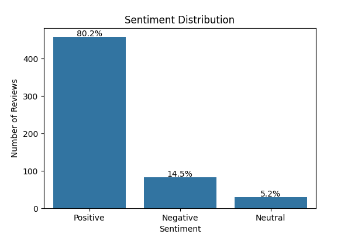

# Annotation QA / Quality Control Pipeline

## Project Overview

This project implements a **Quality Assurance (QA) pipeline for annotated datasets** used in Natural Language Processing (NLP). The goal is to automatically validate the quality of sentiment annotations before the data is used for machine learning model training.

The pipeline performs several checks to detect common issues in annotated datasets such as:

* Missing sentiment labels
* Duplicate reviews
* Invalid annotation labels
* Class imbalance
* Dataset consistency

The project uses a **Nigerian fintech sentiment dataset** consisting of cleaned customer reviews and their corresponding sentiment labels.

---

## Dataset

The dataset used in this project is the **cleaned and annotated version of Nigerian fintech app reviews**.

### File

`data/cleaned_reviews.csv`

### Dataset Structure

| Column          | Description                       |
| --------------- | --------------------------------- |
| cleaned_content | Preprocessed customer review text |
| sentiment       | Sentiment annotation label        |

Example:

```
cleaned_content,sentiment
mobile app works smoothly now,positive
customer service is very slow,negative
transfer completed after retry,neutral
```

---

## Project Structure

<pre>
```annotation-qa-pipeline/
│
├── data/
│   └── cleaned_reviews.csv
│
├── scripts/
│   ├── qc_checks.py
│   ├── duplicate_check.py
│   ├── label_validation.py
│   └── generate_report.py
│
├── notebooks/
│   └── qc_visualization.ipynb
│
├── reports/
│   └── qc_summary.csv
│
├── requirements.txt
├── README.md
└── .gitignore```</pre>

---

## Quality Control Checks

The QA pipeline performs the following validations:

### 1. Missing Value Detection

Checks for missing sentiment labels or missing review text.

### 2. Duplicate Review Detection

Identifies duplicate reviews that may indicate annotation redundancy.

### 3. Label Validation

Ensures that all sentiment labels belong to the expected set:

```
positive
negative
neutral
```

### 4. Sentiment Distribution Analysis

Analyzes the distribution of sentiment labels to detect **class imbalance**.

---

## Visualization

A Jupyter notebook is included to visualize the dataset distribution.

The notebook generates a **sentiment distribution chart with percentage breakdown**, allowing quick identification of annotation bias or imbalance.

---


## Key Observations

The results indicate that the majority of users have a positive experience with fintech banking applications such as Opay, Moniepoint, PalmPay, and Kuda. With over 80% of reviews expressing positive sentiment, the data suggests widespread user satisfaction with features such as:

- Fast money transfers
- Ease of account management
- Mobile-first banking services
- Accessibility of financial services

This high level of positive sentiment highlights the rapid adoption of fintech platforms in Nigeria, particularly among users who prefer convenient digital banking solutions over traditional banking systems.

## Industry Context

Nigeria has experienced significant growth in mobile banking and digital financial services over the past decade. Fintech companies have successfully addressed several pain points traditionally associated with conventional banking, including:

- Long queues at bank branches
- Slow transaction processing
- Limited accessibility in underserved areas

As a result, fintech platforms are increasingly attracting users who seek faster, more efficient, and user-friendly financial services. This shift is gradually influencing the competitive landscape of the Nigerian banking sector, where traditional banks are now facing increasing pressure to improve their digital offerings.

## Implications for Data and AI Projects
The strong positive sentiment observed in this dataset demonstrates the potential value of user review mining and sentiment analysis in understanding customer satisfaction and product perception. Organizations can leverage similar NLP pipelines to:

- Monitor customer feedback at scale
- Identify service issues early
- Track brand perception over time
- Improve product development using data-driven insights

## Installation

Clone the repository:

```
git clone https://github.com/yourusername/annotation-qa-pipeline.git
cd annotation-qa-pipeline
```

Create a virtual environment:

```
python -m venv venv
```

Activate the environment:

**Windows**

```
venv\Scripts\activate
```

**Mac/Linux**

```
source venv/bin/activate
```

Install dependencies:

```
pip install -r requirements.txt
```

---

## Running the QA Checks

Run the scripts inside the `scripts` folder.

Example:

```
python scripts/qc_checks.py
python scripts/duplicate_check.py
python scripts/label_validation.py
python scripts/generate_report.py
```

The pipeline will generate a **QC summary report** inside the `reports` folder.

---

## Output

Example QC summary report:

```
reports/qc_summary.csv
```

| total_records | missing_sentiment | duplicate_reviews |
| ------------- | ----------------- | ----------------- |
|     572       | 0                 | 0                 |

This report provides a quick overview of the dataset's annotation quality.

---

## Tools and Technologies

* Python
* Pandas
* Seaborn
* Matplotlib
* Jupyter Notebook

---

## Use Cases

This project demonstrates how annotation QA pipelines can be used in:

* NLP dataset validation
* AI data quality assurance
* Sentiment analysis preprocessing
* Data annotation workflow validation

---

## Future Improvements

Possible enhancements include:

* Inter-annotator agreement metrics
* Automated data quality dashboards
* CLI-based QA pipeline execution
* HTML reporting for dataset diagnostics

---

## License

This project is open-source and available for educational and research purposes.
